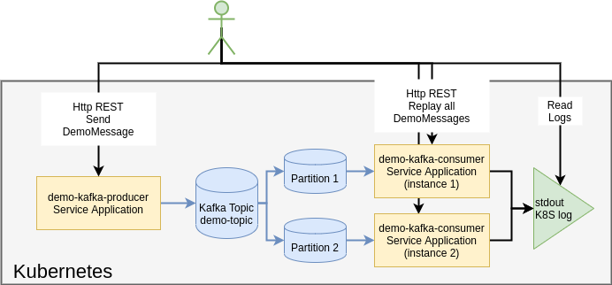

# demo-kafka
Demonstration of basic capability of Kafka using Kotlin language


# Overview

This application is basic demonstration of Kafka capabilities access by app built with Kotlin language.

This setup demonstrates following capabilities:
- Kotlin based application and Spring Boot framework
- Integration of Kotlin application and Kafka
- Microservice kind setup in Kubernetes
- Kafka capabilities for topic partitioning
- Spring Boot Kafka module capabilities for rebalancing assignment to Kafka partition
- Kafka capabilities for message replay

## Considered Limitation

Following feature is considered as limitation and not covered in this demo:

- Kafka Replication and HA
- Kafka durable persistence
  - Backup
- Kafka health-monitoring
  - Kafka broker automatic recovery

# Deployment Overview

It consist of two Spring Boot application which deployed as service to Kubernetes and Kafka broker.
- First application named demokafka-producer produces message to Kafka message bus, and it is controlled by user over HTTP REST API to send a message through Kafka.
- Second appplication named demokafka-cosnumer consumes messsage from Kafka message and prints to stdout. To demonstrate Kafka partitioning capabilities consumer is deployed with replica factor 2, Spring boot kafka framework automatically manages consumer group to make sure that partitioning assignment distributed equaly. 
- Kafka is also deployed to Kubernetes as well.



# Project Structure

Project strucuture is split into 3 folder:
- application - source code with demokafka application
- scripts - set of scripts to build/deploy/configure components of the project
- documents - supporting documents

# Build

To build application from source gradle build tool is used, all other deployment is automated using shell scripts.

Steps to build and deploy are follows:
1. Install Open JDK 14
   - Make sure that JAVA_HOME is configured properly
2. Install kubernets - scrips were test with Microk8s version for demo deployment
   - Enable k8s coredns addon
3. Install docker
4. Make sure that your user have all neccessary access to run kubectl, docker, microk8s commands from command line
5. Configure DNS:
   - Run ./scripts/k8s/get-core-dns-settings.sh - it will print necessary configuration, that needs to be put into /etc/resolv.conf
   - Edit /etc/resolv.conf - make sure that nameserver entry is placed before other configurations 
6. Deply kakfa
   - Run ./scripts/kafka/install.sh - deployment process is automated in provided scripts
7. Deploy application
   - Run ./scripts/application/install.sh

In case of succefull execution of all steps above, application should be avaible and API described using swagger:
- http://demokafka-producer:8080/swagger-ui.html
- http://demokafka-consumer:8080/swagger-ui.html 

# Usage

Producer:
 - http://demokafka-producer:8080/swagger-ui.html
   - send-demo-message-controller
 - Request example
   ```bash
   curl -X POST "http://demokafka-producer:8080/send" -H "accept: */*" -H "Content-Type: application/json" -d "Message body content"
   ```

Consumer: 
 - http://demokafka-consumer:8080/swagger-ui.html
   - consumer-controller
 - Request example
   ```bash
   curl -X POST "http://demokafka-consumer:8080/replay" -H "accept: */*"
   ```

To see consumer service output with consumed message output, please use following kafka:
```bash
kubectl logs -f -l app=demokafka-consumer-application
```

# Project Dependecies
This components needs to be installed manually

- Open JDK 14
- Microk8s 
  - with Coredns enabled
  - For convinience /etc/resolv.conf can be configured to integrate with K8S dns
    - Script get-core-dns-settings.sh is provided within scripts/k8s/ folder
- Docker
